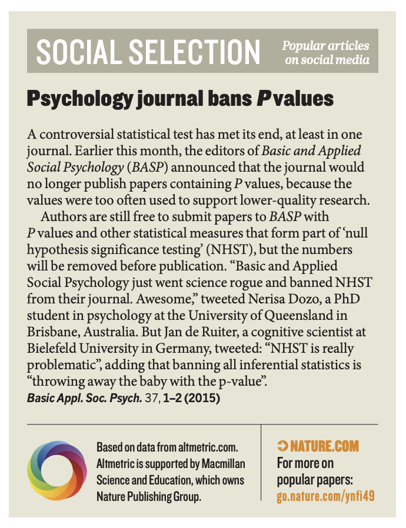
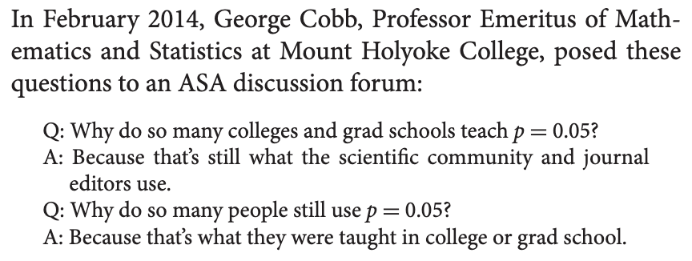

```{r setup, include=FALSE}
options(htmltools.dir.version = FALSE)
knitr::opts_chunk$set(echo = FALSE)
```

```{r xaringan-themer, include = FALSE}
library(xaringanthemer)
write_xaringan_theme(
  text_font_size = "25px",
  header_h1_font_size = "65px",
  header_h2_font_size = "55px",
  padding = "1em 1em 1em 1em",
  inverse_background_color = "#13294B",
  footnote_font_size = "0.35em",
  extra_css = list(
    ".red" = list(color = "red")
  )
)
```

class: center, middle

> We conclude, based on our review of the articles in this special issue and the broader literature, that it is time to stop using the term “statistically significant” entirely. Nor should variants such as “significantly different,” “p < 0.05,” and “nonsignificant” survive, whether expressed in words, by asterisks in a table, or in some other way.
> 
> Ron Wasserstein, Allen Schirm, and Nicole Lazar, *The American Statistician*, 2019

.footnote[
Wasserstein RL, Schirm AL, Lazar NA. Moving to a World Beyond “p < 0.05.” *Am Stat.* Taylor & Francis; 2019;73:1–19.; 
]

---
background-image: url("https://media.giphy.com/media/l2SpLQgNpVORsiqVW/giphy.gif")
background-size: cover
background-position: center

---

# Summary of today's presentation

1. ASA 2016 Statement: what *not* to do with p-values
2. 2019 Editorial, special issue of *The American Statistician*: what *to do*
3. Rewriting a results section/responding to a reviewer

---

class: inverse, center, middle

# Let's give some context...

---
# Previous warnings

* 1966: Bakan D. The test of significance in psychological research. *Psychol Bull*  
* 1988: Evans SJ, Mills P, Dawson J. The end of the p value? *Br Heart J*  
* 1995: Altman DG, Martin Bland J. Statistics notes: Absence of evidence is not evidence of absence. *BMJ*  
* 2016: Greenland S, Senn SJ, Rothman KJ, Carlin JB, Poole C, Goodman SN, et al. Statistical tests, P values, confidence intervals, and power: a guide to misinterpretations. *Eur J Epidemiol*  

---

# Previous warnings

* 1966: Bakan D. The test of significance in psychological research. *Psychol Bull*  
* .red[1988]: Evans SJ, Mills P, Dawson J. .red[The end of the p value?] *Br Heart J*  
* 1995: Altman DG, Martin Bland J. Statistics notes: Absence of evidence is not evidence of absence. *BMJ*  
* 2016: Greenland S, Senn SJ, Rothman KJ, Carlin JB, Poole C, Goodman SN, et al. Statistical tests, P values, confidence intervals, and power: a guide to misinterpretations. *Eur J Epidemiol*


---
# Example incorrect interpretations

1. If you reject the test hypothesis because $p \le 0.05$, the chance you are in error is 5%.
2. A large p value is evidence in favor of the test hypothesis.
3. If two confidence intervals overlap, the difference between two estimates or studies is not significant.


.footnote[Greenland S, Senn SJ, Rothman KJ, Carlin JB, Poole C, Goodman SN, et al. Statistical tests, P values, confidence intervals, and power: a guide to misinterpretations. Eur J Epidemiol. Springer; 2016;31:337–50.]

---
class: inverse, middle, center

## Statistics as a profession had refrained from any official statements

---

## Then this happened

.center[
```{r, out.height='300px'}

```
]

P-values banned in *Basic and Applied Social Psychology* in 2015 (and confidence intervals, too)

---
## ASA reacted by creating a statement on the use of p-values in 2016.

* Had never before made a statement on statistical practice
* Collection of ~20 statisticians met to discuss the issue
* Statement approved by ASA executive committee, discussants invited to comment and published as supplemental material
* Cited > 2,000 times

.footnote[Wasserstein RL, Lazar NA. The ASA Statement on p-Values: Context, Process, and Purpose. Am Stat. Taylor & Francis; 2016;70:129–33.]

---

## 6 principles in 2016 ASA statement on p values

1. P-values can indicate how incompatible the data are with a specified statistical model
2. P-values do not measure the probability that the studied hypothesis is true, or the probability that the data were produced by random chance alone
3. Scientific conclusions and policy or business decisions should not be based only on whether a p-value passes a specific threshold
4. Proper inference requires full reporting and transparency
5. A p-value, or statistical significance, does not measure the size of an effect or the importance of a result
6. By itself, a p-value does not provide a good measure of evidence regarding a model or hypothesis

---

class: center, middle 

> Knowing what not to do with p-values is indeed necessary, but it does not suffice. It is as though statisticians were asking users of statistics to tear out the beams and struts holding up the edifice of modern scientific research without offering solid construction materials to replace them. Pointing out old, rotting timbers was a good start, but now we need more.
> 
> --- Ron Wasserstein, Allen Schirm, and Nicole Lazar

---

# Symposium on Statistical Inference

* ASA called a meeting in 2017, capped at 200 people to encourage discussion
* Some speakers were invited to submit a paper based on their talk at this conference
* Editors of *The American Statistician* chose which to include, resulting in the issue proclaiming that "statistically significant" should no longer be used

---

# ASA 2019 Editorial

## Four principles

**A**ccept uncertainty.
--
Be **t**houghtful,
--
**o**pen,
--
and **m**odest.
--

.center[# ATOM]

.footnote[
Wasserstein RL, Schirm AL, Lazar NA. Moving to a World Beyond “p < 0.05.” *Am Stat.* Taylor & Francis; 2019;73:1–19.; 
]
---
class: inverse, middle, center

# Accept uncertainty

---
class: center, middle 

> ... it seems to me that statistics is often sold as a sort of alchemy that transmutes randomness into certainty, an “uncertainty laundering” that begins with data and concludes with success as measured by statistical significance. Again, I do not exempt my own books from this criticism: we present neatly-packaged analyses with clear conclusions. This is what is expected --demanded-- of subject-matter journals. Just try publishing a result with p = 0.20. If researchers have been trained with the expectation that they will get statistical significance if they work hard and play by the rules, if granting agencies demand power analyses in which researchers must claim 80% certainty that they will attain statistical significance, and if that threshold is required for publication, it is no surprise that researchers will routinely satisfy this criterion, and publish, and publish, and publish, even in the absence of any real effects, or in the context of effects that are so variable as to be undetectable in the studies that are being conducted (Gelman and Carlin, 2014).
> 
> --- Andrew Gelman, 2016

---

# Other suggestions

* Think of confidence intervals as "compatibility intervals", which show the range of true values consistent with the data
* Embrace variation in effects; no effect is exactly 0
* Guards against thinking you have "found a true effect" if p < 0.05

---

class: inverse, center, middle

# Be thoughtful,


---

# Be thoughtful 

* Big picture: what are the practical implications of the estimate? How precise is the estimate? Is the model correctly specified?
* Prior context and knowledge: what effects are practically important? what effects are plausible?
* Communication of confidence: what true values are compatible with your data? what is the probability you thought the treatment effect was near 0 to begin with?

---

# Ziliak's G-values

A selection of suggestions:

1. study correlated data
2. consider the purpose of the inquiry, and compare with best practice (e.g., does your treatment seem to have a meaningfully better effect on the outcome of interest, compared to best practice)
3. consider prior information (how big would you have expected the result to be, *before* doing the experiment?)


.footnote[Taken from the phrase "Guinnessometrics", which the author Ziliak coined after review of statistical procedures performed by William Sealy Gosset (aka, "Student's" t test)]

---

class: inverse, center, middle

# open,

---
# Be open

* Openness to transparency and the role of expert judgement: be aware of [open science practices](https://osf.io/); recognize that subjective decisions are made in any analysis
* Openness in communication: you can do whatever you want, as long as you tell people what you did; report p values as continuous
* Allow others to do meaningful, alternative analyses as much as possible

---

class: inverse, center, middle

# and modest.


---
class: center, middle 

> A core problem is that both scientists and the public confound statistics with reality. But statistical inference is a thought experiment, describing the predictive performance of models about reality. Of necessity, these models are extremely simplified relative to the complexities of actual study conduct and of the reality being studied. Statistical results must eventually mislead us when they are used and communicated as if they present this complex reality, rather than a model for it. This is not a problem of our statistical methods. It is a problem of interpretation and communication of results.
> 
> --- Amrhein, Trafimow, and Greenland

---

# Be modest

* Consider many different plausible models and report the results of all of them (["multiverse analysis"](http://www.stat.columbia.edu/~gelman/research/published/multiverse_published.pdf))
* "If the study's limitations are expressed in the paper but not in the abstract, they may never be read." (p.8 of 2019 editorial)
* Encourage reproducibility; maybe you made a mistake

---

# Editors' parting thoughts

* Editorial, education, and other institutional practices will have the change
  * we have to become more emotionally comfortable with uncertainty
* It is going to take work, and it is going to take time

--
```{r}

```

---

# Difficulties of new recommendation

1. not sure what to write in Results and Discussion sections
2. probability of acceptance at a given journal may go down
3. more effort required for same payoff (i.e., publication)

---

# Benefits

1. protect you against false positives
2. protect you against false negatives
3. your statistics/results/discussion sections appropriately reflect your Scientific uncertainty

---

class: inverse, center, middle

# An example...

---


# My background

.middle[
.pull-left[
* Biology (evolution/ecology), but PhD in Biostatistics and work as an applied statistician
* Was always interested in how data were actually used to evaluate theories
* Served as both lead author and collaborating statistician on applied papers
* I've said "statistically significant" about p-values quite a lot
]

.pull-right[

]
]

---
# Rewriting a results section

My Master's paper was titled, ["Fine particulate matter and incident cognitive impairment in the REasons for Geographic and Racial Differences in Stroke (REGARDS) cohort"](https://journals.plos.org/plosone/article?id=10.1371/journal.pone.0075001). Here is Table 5 from the paper:
```{r, echo=FALSE}
knitr::include_graphics("figure.png")
```

---
class: center, middle
> Model 1 indicated that there was no association between PM2.5 and the odds of incident cognitive impairment. The odds ratio decreased sharply after demographics were added (model 2), with an odds ratio close to 1. This estimated odds ratio was more or less constant for models 3 and 4.

---
class: center, middle
## So my writing obviously violated the ASA's current statement. Here is what I would write today...

---
class: center, middle

> Model 1 suggested that a 10 µg/m3 higher annual average exposure to PM2.5 was associated with an approximately 25% higher odds of cognitive impairment. After adjustment for additional potential confounders, the odds of cognitive impairment were very similar between someone with a, say, 15 µg/m3 vs. a 5 µg/m3 annual average exposure to PM2.5. However, the confidence intervals also indicated the data was consistent with large negative and positive associations between PM2.5 exposure and cognitive impairment. Therefore, it is difficult to make any confident statements about the adjusted relationship, based upon our data."


---

# Responding to a journal reviewer

Let's say you follow the advice above and avoid using the phrase "statistically significant," and you get the following review:

> The authors have not performed hypothesis tests for their claims, and so it is unclear what rigor their results have. Using p values is so important that it's how we approve medical treatments. Therefore, it's difficult to ascertain the strength of the authors' findings without them assigning a predetermined type 1 error rate to their p values and then testing the null hypothesis of no effect. How do we know to trust the effect or not? Is the signal greater than the noise? 

---
Here's what my response might look like

> We thank the reviewer for their prudent comment. There has been much discussion recently about the use of p-values to test scientific hypotheses, and much of the discussion concentrates on the damage the p value has caused to the reproducibility of scientific studies.[1] In order to protect ourselves against overly optimistic conclusions, we have decided to clearly represent: (a) the best estimate for the mean difference between treatment and control; and (b) the uncertainty we have about the mean difference, using a confidence interval. Our uncertainty interval indicated that our data is consistent with many positive values of the treatment effect, but we could not rule out small, harmful effects of the treatment. These harmful effects that were consistent with the data are not clinically meaningful. Therefore, we have concluded that the treatment likely has a helpful effect.

.footnote[
[1] Wasserstein RL, Schirm AL, Lazar NA. Moving to a World Beyond “p < 0.05.” Am Stat. Taylor & Francis; 2019;73:1–19.; 
]

---

# Benefits of abandoning "statistical significance"

1. you get to think about the veracity of estimates of effects, without being beholden to an arbitrary cutoff
2. better sense of your uncertainty about the question --> claims are more reproducible
3. estimate + uncertainty helps you think more about whether your estimate is believable

---

```{r}

```

* Bans use of p values when reporting tests with no prespecified plan for multiple comparisons corrections
* Statisticians seem to be a bit underwhelmed, but it's a start.
* 3 premises of new policy:
  1. adherence to prespecified analysis plan, if there is one;
  2. using statistical thresholds should be limited to cases with prespecified plan for controlling type 1 error; and
  3. evidence about benefits and harms should include a point estimate and margin of error

.footnote[Harrington D, D’Agostino RB Sr, Gatsonis C, Hogan JW, Hunter DJ, Normand S-LT, et al. New Guidelines for Statistical Reporting in the Journal. N Engl J Med. 2019;381:285–6.]

---

# Resources that have helped me

.pull-left[
```{r, out.height="350px"}
knitr::include_graphics("http://www.stat.columbia.edu/~gelman/arm/cover.gif")
```
]


.pull-right[
```{r, out.height="350px"}
knitr::include_graphics("https://xcelab.net/rm/wp-content/uploads/2012/01/9781482253443.jpg")
```
]

---

# Resources that have helped me

.pull-left[


[Andrew Gelman's Blog](https://statmodeling.stat.columbia.edu)
]

.pull-right[


[Frank Harrell's Blog](https://www.fharrell.com/post/)
]
